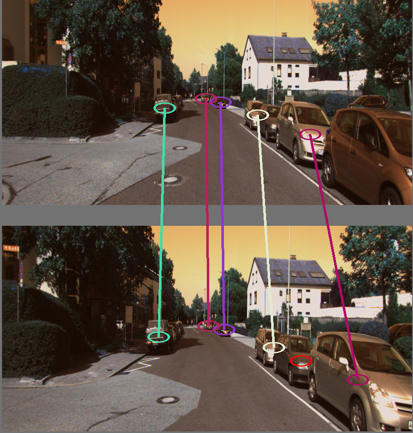
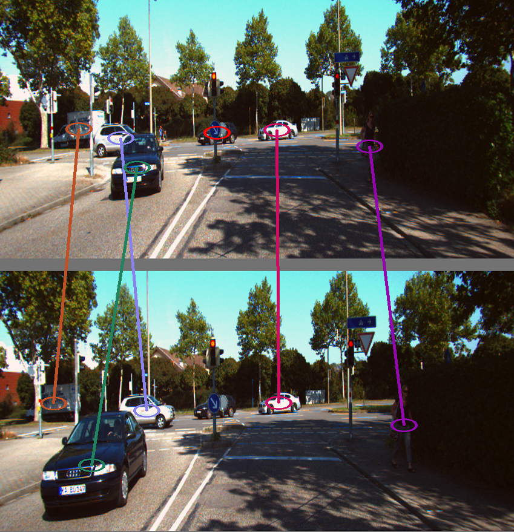
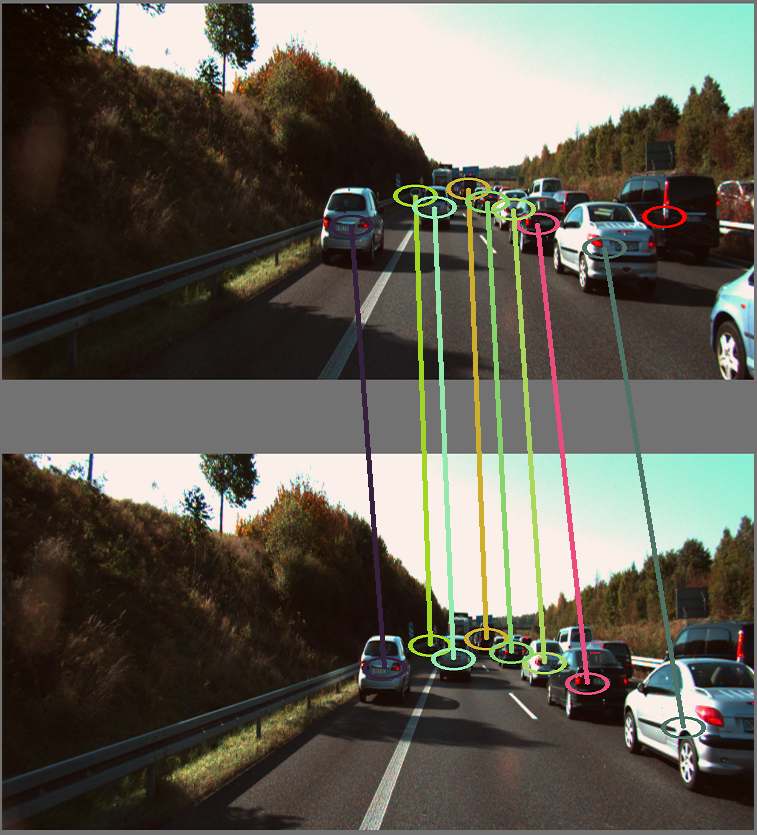
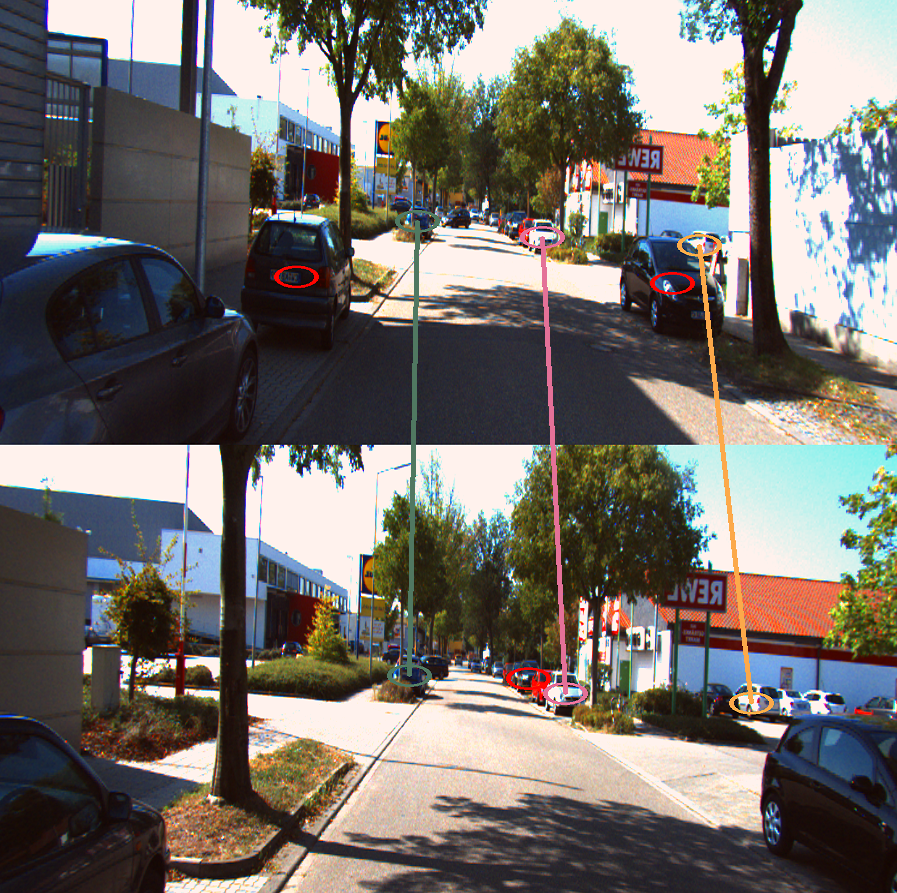
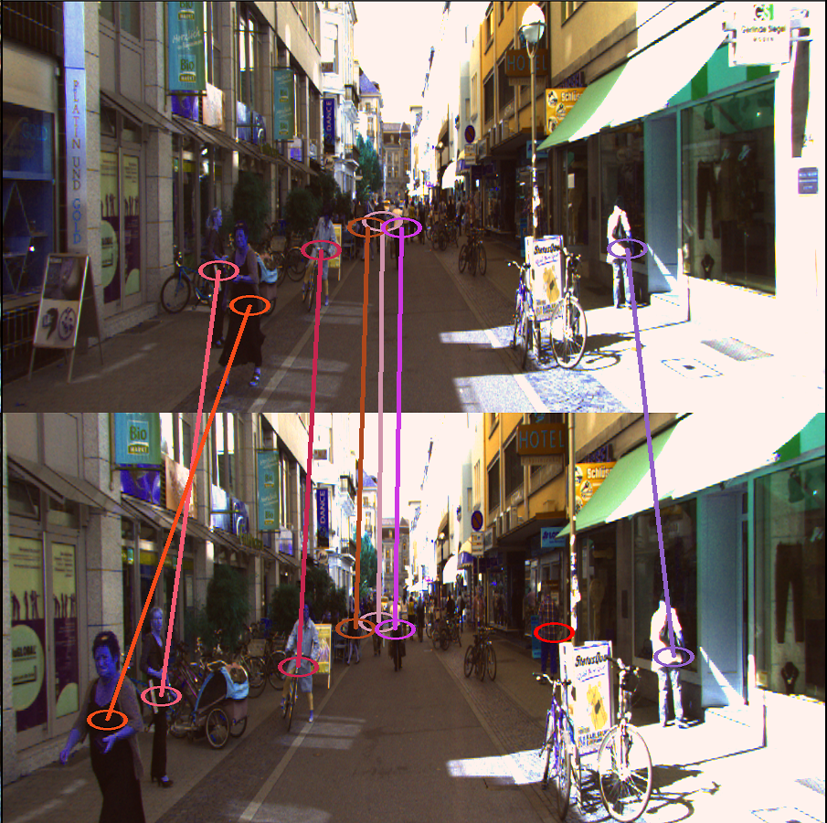
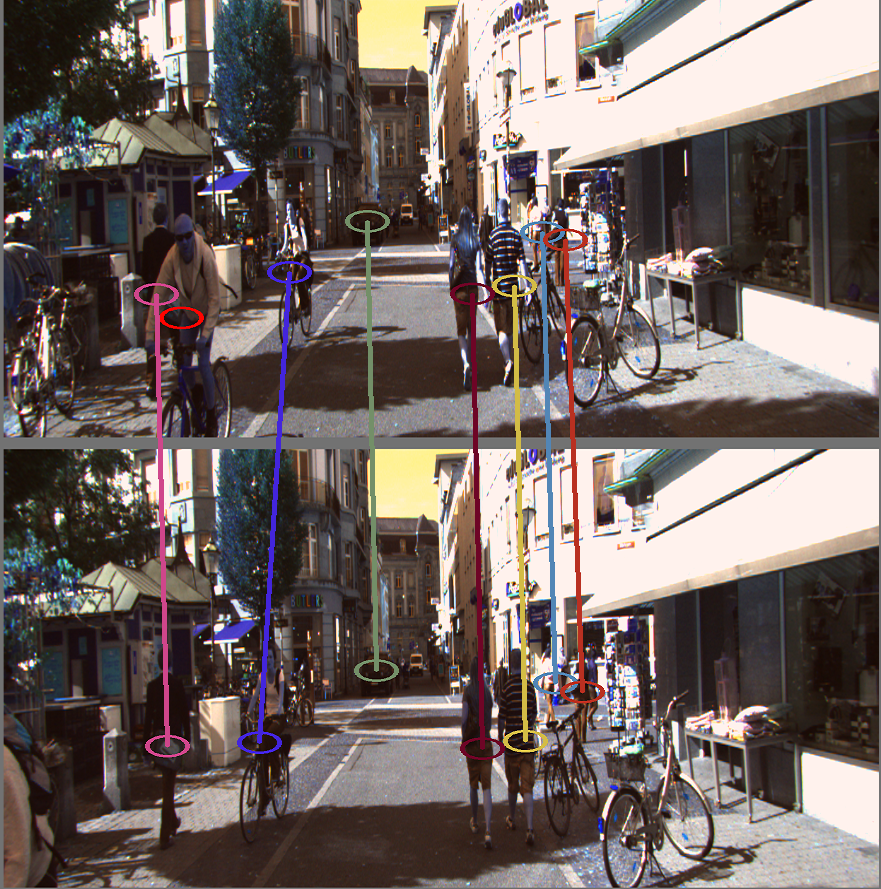
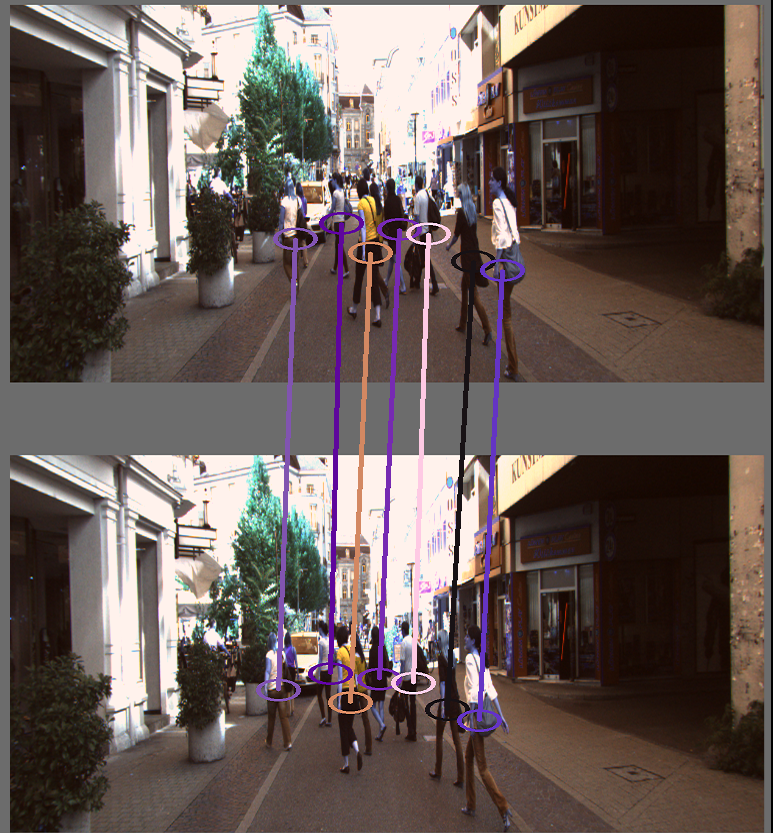
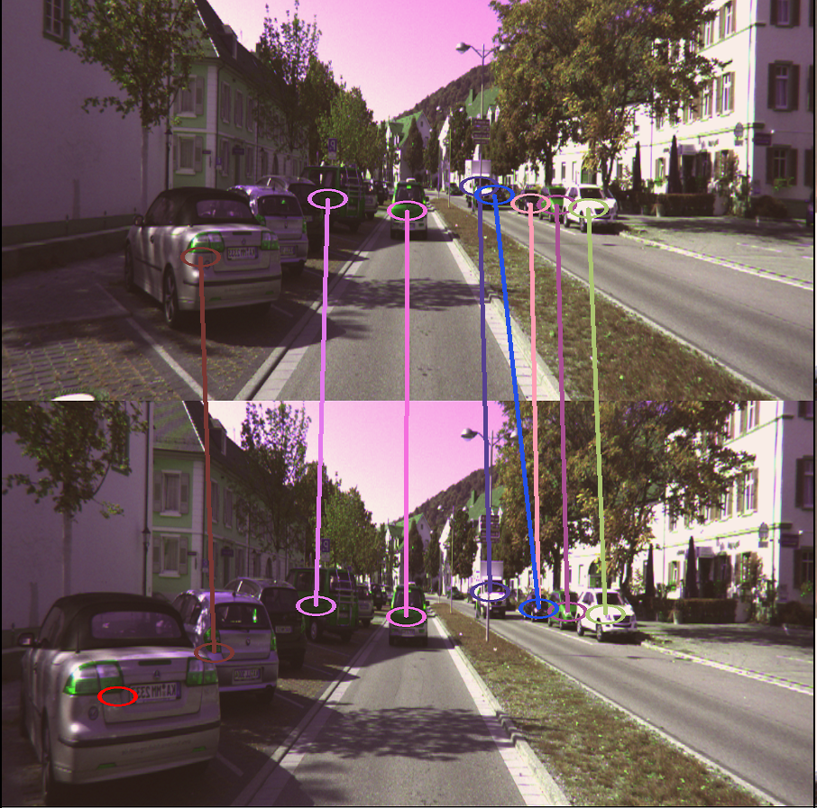
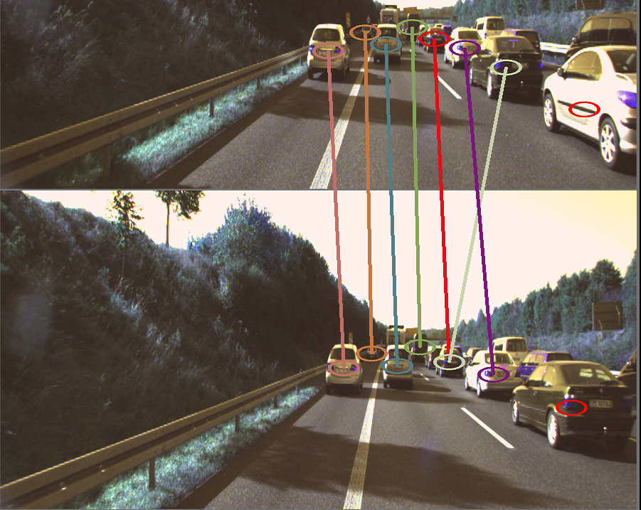

# SST (Single Shot Tracker)
## Purpose
Designing an end-to-end deep learning tracker.
## Task
|Title|Start|Due|Detail| Status |
|---|---|---|---|---|
|Optimize the training process of KITTI| 2018/04/23 | 2018/04/26| needs to reach 95%+ | doing |
|Train with gap frame 5|  2018/04/18  | 2018/04/20  | Training the sst with the parameter (gap frame 5)  | Finish |
Test KITTI | 2018/04/18 | 2018/04/20 | Get the result of KITTI and upload the result to the official website.| delay |
Continue Train KITTI | 2018/04/16 | 2018/04/18 | Continue training KITTI|Finish|
Training KITTI dataset | 2018/04/11 | 2018/04/16 | Training KITTI dataset   |   Finish |
Complete ReadMe | 2018/04/13 | 2018/04/14 | Complete the basic content of ReadMe |  Finish  |


## Requrement
Our network is designed by pytorch framework. It is also trained and tested in Ubuntu13.1 system. The following package is required.
- python package
    - cuda8
    - python version 3.5
    - numpy
    - pandas
    - [pytorch0.31]( http://download.pytorch.org/whl/cu80/torch-0.3.1-cp35-cp35m-linux_x86_64.whl )
    - torchvision
    - python-opencv
    - [motmetrics](https://github.com/cheind/py-motmetrics)
    - [tensorboardX](https://github.com/lanpa/tensorboard-pytorch.git)

# Best Result


see [current training log](http://ssjhttp.ssj-server.me:8083)

## Some cool example


















# Problem




# Train
We provide a convient way to train the network. Currently, MOT dataset, KITTI dataset is supported.
## MOT
- Go to the root folder of this project
- In config/config.py, change the configure in function init_train_mot() and decomment the code as follows:
 ```python
    init_train_kitti()
 ```
- Run the following command
```python
PYTHONPAHT=. python train_kitti.py
```

## KITTI
- Go to the root folder of this project
- In config/config.py, change the configure in function init_train_kitti() and decomment the code as follows:
 ```python
    init_train_kitti()
 ```
- Run the following command
```python
PYTHONPAHT=. python train_kitti.py
```

# Test
Similar to the train, we also provide a convient way to test the network. Currently only support MOT dataset, KITTI dataset.

## MOT
- Go to the project folder
- In config/config.py, change the configure in function init_test_mot() and decommend the code as follows:
```python
    init_test_mot()
```
- Run the following command:
```python
PYTHONPATH=. python test_mot.py
```
## KITTI
- Go to the project folder
- In config/config.py, change the configure in function init_test_kitti() and decommend the code as follows:
```python
    init_test_kitti()
```
- Run the following command:
```python
PYTHONPATH=. python test_kitti.py
```

# Log
## 2018/04/23 Continue Training KITTI
The accuracy of training kitti reaches at about 92%

|parameter name | value     |
|---            |---        |
|learning rate  | 0~40k(1e-2), 40k~50k(1e-3), 50k~55k(1e-4), 55k~70k(1e-3), 70k~75k(1e-4), 75k~80k(1e-5)|
|max gap        | 5         |


## 2018/04/19 Problems
We find that it is a very difficult task when the gap frame is 30. Because, there 10m when the car's speed is 30km/s. What's more, the car has similar appearance, so it's hard to decide whether its a new object or not. As a result, the accuracy of sst net is about 83% shown as follows.

|parameter name | value |
|---            |---    |
|learning rate  |0~35k(5e-3), 35k~45k(5e-4), 45k~50k(5e-5), 50k~65k(5e-6)|
|maxmimum gap   |   30  |


In order to solve this problem properly, we adjust the gap frame from 30 to 5.


## 2018/04/16 Fix the tensorboard histogram problem
We find the problem in showing the histogram of weight, see follows


We fix this problem by replace the code

```python
writer.add_histogram(name, param.clone().cpu().data.numpy(), iteration)
```
by

```python
writer.add_histogram(name, param.clone().cpu().data.numpy(), iteration, bins='doane')
```

Besdies, we also fix the issue in kitti.py for reading data.

## 2018/04/14 Continue Training KITTI
I have tried to continue training the network by the follow paraemter

|parameter name|value|
|---|---|
learning rate | 55k~85k(1e-2), 85k~100k(1e-3)
maximum gap | 30

But the result is bad.


So I plan to change the "Constant Value" from 10 to 1 and see what happens.

## 2018/04/13 Training KITTI
we trained the kitti dataset by the following parameters

|parameter name| value |
|---|---|
|learning rate| 0-50k(1e-2), 50k-65k(1e-3)|
|maximum gap| 30 |

The result and accuracy is shown below:


> we find that if we decrease the learning or keep it as 1e-3, we get get better result.

> We also find that it's so hard to matching cars even for human being when the frame gap is 30

