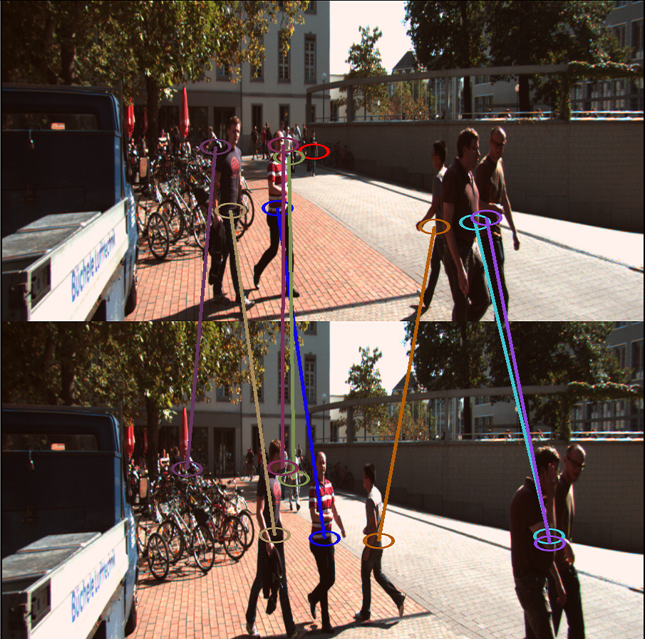
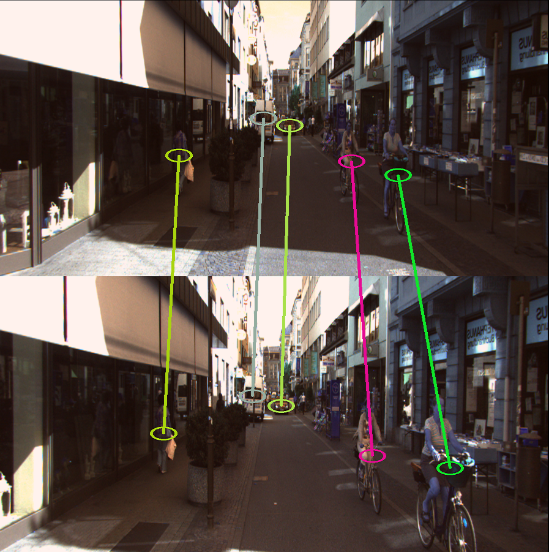
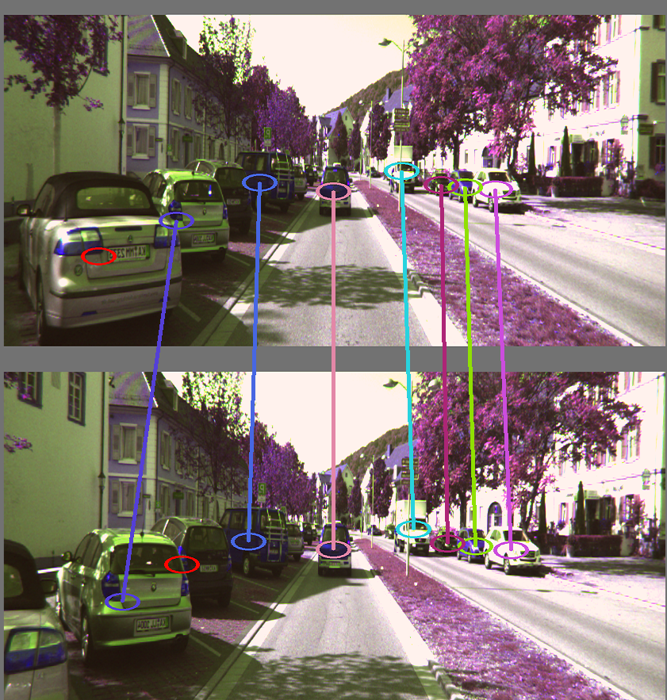
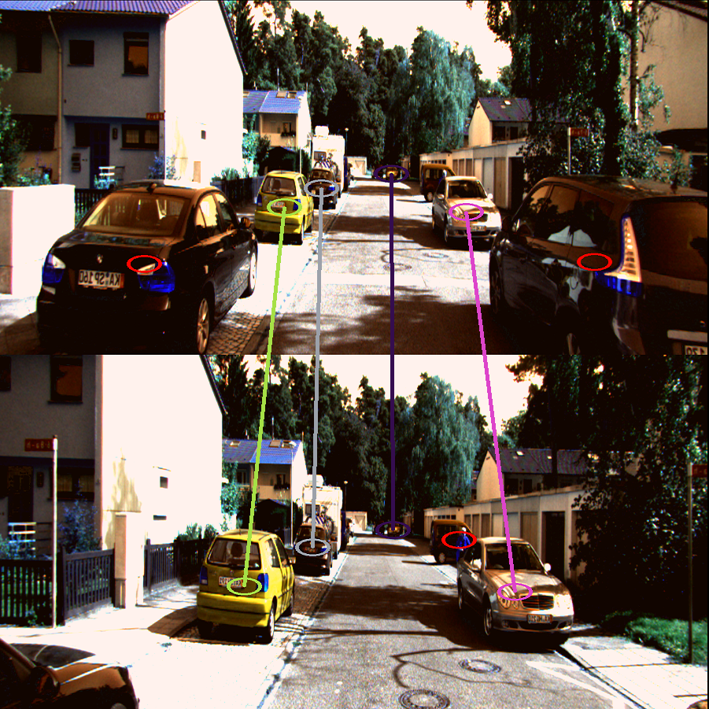
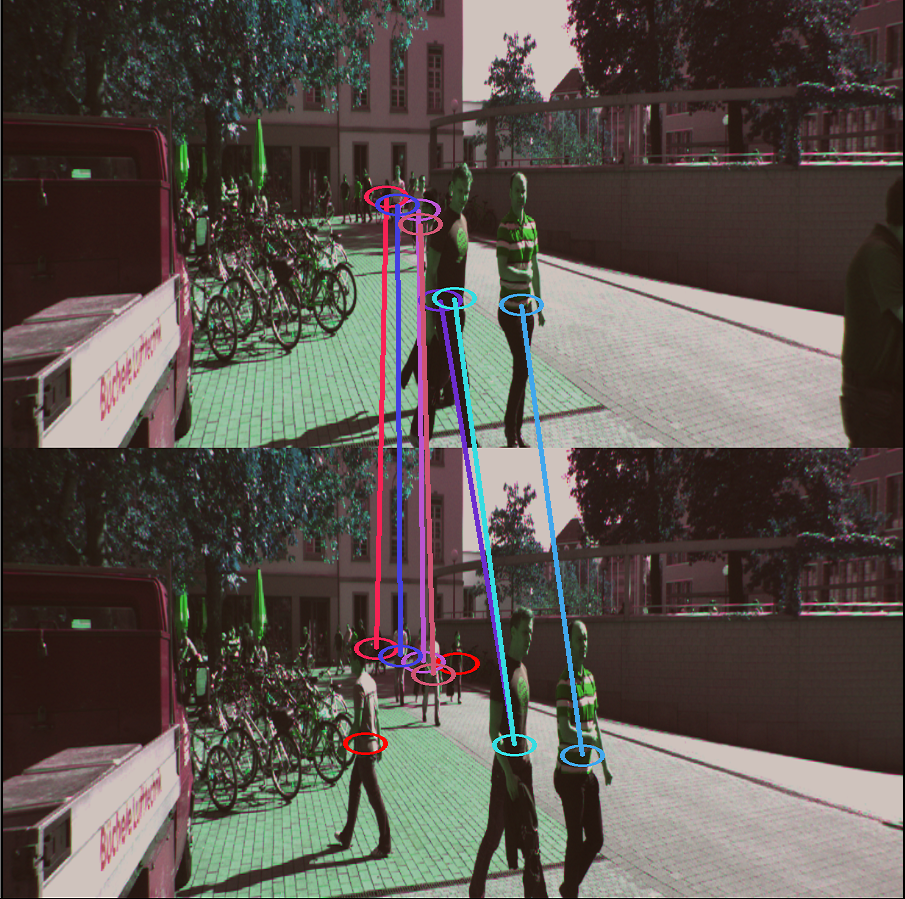
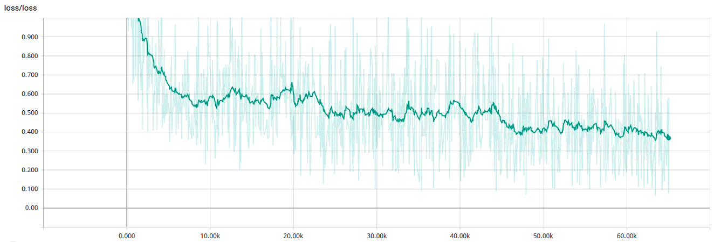
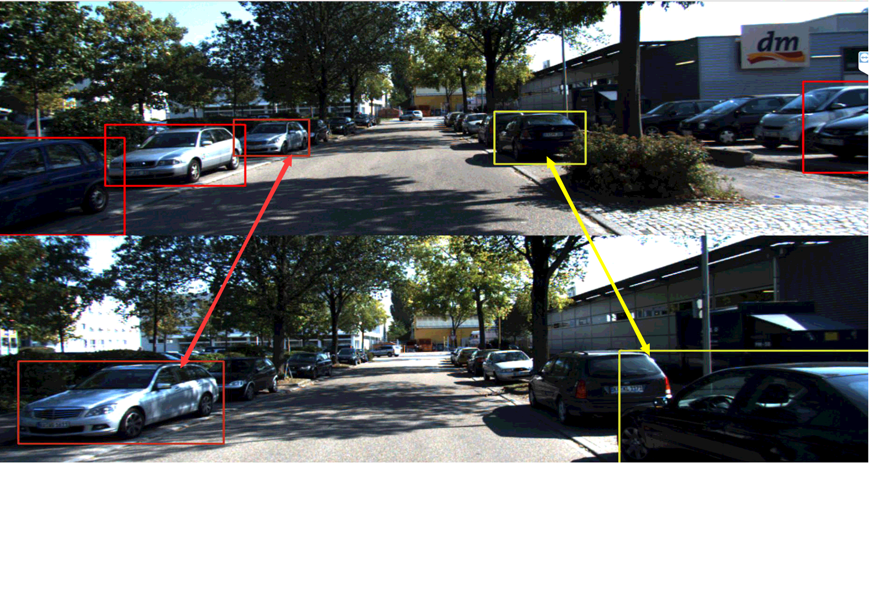

# SST (Single Shot Tracker)
## Purpose
SST is an end-to-end deep learning network during train phase, whose purpose is to extracted object feature along with its surrounding's feature and output a similarity matrix to indicate the similarity of boxes from different frames.

## Task
### Current Task

|Title|Start|Due|Detail| Status |
|---|---|---|---|---|
Update ReadMe           | 2018/08/10    | -             |                                       |               |
Re-evaluate MOT17       | 2018/08/10    | -             |                                       |               |
Fix Result of UA-DETRAC | 2018/08/01    | -             |                                       |               |


### History Task
|Title|Start|Due|Detail| Status |
|---|---|---|---|---|
Start UA-DETRAC     | 2018/04/23        | 2018/08/09    | Everything goes well                  |   Finish      |
Recoding framework  | 2018/05/07        | 2018/05/09    | based on similarity matrix to recoding|   Finish      |
KITTI               | 2018/04/11        | 2018/04/23    | Training, Optimize                    |   Give up:(   |
Re-Train KITTI      | 2018/04/18        | 2018/04/20    | with gap frame 5                      |   Finish      |
Continue Train KITTI| 2018/04/16        | 2018/04/18    | Continue training KITTI               |   Finish      |
Training KITTI dataset|2018/04/11       | 2018/04/16    | Training KITTI dataset                |   Finish      |
Evaluate SST On MOT17|2018/02           | 2018/03/28    | Top 1 at MOT17                        |   Finish      |
Start MOT17         | 2017/12           | 2018/02       | Get the primary result                |   Finish      |
Design Framework    | 2017/11           | 2017/11       | The tracking framework                |   Finish      |
Select Dataset      | 2017/11           | 2017/11       | MOT17, KITTI, UA-DETRAC               |   Finish      |
Designing network   | 2017/10           | 2017/10       | Designing the network for training    |   Finish      |
Start the project   | 2017/10           | 2017/10       | This idea is based on SSD             |   Finish      |

## Requirement
Our network and framework is based on cuda 8.0 and python 3.5.

After install cuda 8.0, get into the project folder, and run the following shell code.

```shell
pip install -r requirement.txt
```

## Dataset
Our final result is based on two mot dataset [MOT17](https://motchallenge.net/data/MOT17/) and [UA-DETRAC](https://detrac-db.rit.albany.edu/). MOT 17 is focusing on tracking pedestrian, while UA-DETRAC is focusing on tracking vehicles.

### MOT17
1. Download the [mot 17 dataset 5.5 GB](https://motchallenge.net/data/MOT17.zip) and [development kit 0.5 MB](https://motchallenge.net/data/devkit.zip).
2. Unzip this the dataset. Its folder is denoted as <MOT17_ROOT>.


### UA-DETRAC

1. Download all the package in the [official set](http://detrac-db.rit.albany.edu/download) into a folder "ua", which is the root of this dataset.
2. Use "tools/convert_mat_2_ua.py" to convert the DETRAC-Train-Annotations-MAT to the text file

```shell
unzip \*.zip
```

## Testing
### MOT17
- Go to the project folder
- In config/config.py, change the configure in function init_test_mot() and decommend the code as follows:
```python
    init_test_mot()
```
- Run the following command:
```python
PYTHONPATH=. python test_mot.py
```

### UA-DETRAC


### KITTI
- Go to the project folder
- In config/config.py, change the configure in function init_test_kitti() and decommend the code as follows:
```python
    init_test_kitti()
```
- Run the following command:
```python
PYTHONPATH=. python test_kitti.py
```

## Training
We provide a convient way to train the network. Currently, MOT dataset, KITTI dataset is supported.
## MOT
- Go to the root folder of this project
- In config/config.py, change the configure in function init_train_mot() and decomment the code as follows:
 ```python
    init_train_kitti()
 ```
- Run the following command
```python
PYTHONPAHT=. python train_kitti.py
```

## KITTI
- Go to the root folder of this project
- In config/config.py, change the configure in function init_train_kitti() and decomment the code as follows:
 ```python
    init_train_kitti()
 ```
- Run the following command
```python
PYTHONPAHT=. python train_kitti.py
```

## CopyRight

## Some Cool Examples:














<!--# Log-->
<!--## 2018/04/23 Continue Training KITTI-->
<!--The accuracy of training kitti reaches at about 92%-->

<!--|parameter name | value     |-->
<!--|---            |---        |-->
<!--|learning rate  | 0~40k(1e-2), 40k~50k(1e-3), 50k~55k(1e-4), 55k~70k(1e-3), 70k~75k(1e-4), 75k~80k(1e-5)|-->
<!--|max gap        | 5         |-->

<!---->
<!---->

<!--## 2018/04/19 Problems-->
<!--We find that it is a very difficult task when the gap frame is 30. Because, there 10m when the car's speed is 30km/s. What's more, the car has similar appearance, so it's hard to decide whether its a new object or not. As a result, the accuracy of sst net is about 83% shown as follows.-->

<!--|parameter name | value |-->
<!--|---            |---    |-->
<!--|learning rate  |0~35k(5e-3), 35k~45k(5e-4), 45k~50k(5e-5), 50k~65k(5e-6)|-->
<!--|maxmimum gap   |   30  |-->

<!---->
<!---->

<!--In order to solve this problem properly, we adjust the gap frame from 30 to 5.-->


<!--## 2018/04/16 Fix the tensorboard histogram problem-->
<!--We find the problem in showing the histogram of weight, see follows-->

<!---->

<!--We fix this problem by replace the code-->

<!--```python-->
<!--writer.add_histogram(name, param.clone().cpu().data.numpy(), iteration)-->
<!--```-->
<!--by-->

<!--```python-->
<!--writer.add_histogram(name, param.clone().cpu().data.numpy(), iteration, bins='doane')-->
<!--```-->

<!--Besdies, we also fix the issue in kitti.py for reading data.-->

<!--## 2018/04/14 Continue Training KITTI-->
<!--I have tried to continue training the network by the follow paraemter-->

<!--|parameter name|value|-->
<!--|---|---|-->
<!--learning rate | 55k~85k(1e-2), 85k~100k(1e-3)-->
<!--maximum gap | 30-->

<!--But the result is bad.-->
<!---->
<!---->

<!--So I plan to change the "Constant Value" from 10 to 1 and see what happens.-->

<!--## 2018/04/13 Training KITTI-->
<!--we trained the kitti dataset by the following parameters-->

<!--|parameter name| value |-->
<!--|---|---|-->
<!--|learning rate| 0-50k(1e-2), 50k-65k(1e-3)|-->
<!--|maximum gap| 30 |-->

<!--The result and accuracy is shown below:-->
<!---->
<!---->
<!-- we find that if we decrease the learning or keep it as 1e-3, we get get better result.-->

<!-- We also find that it's so hard to matching cars even for human being when the frame gap is 30-->
<!---->
